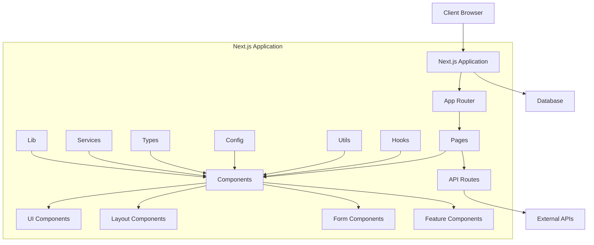
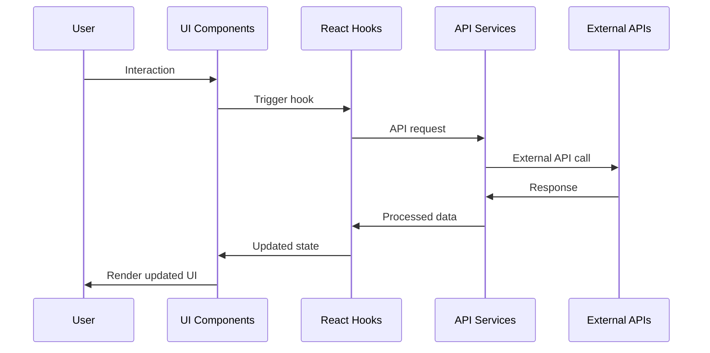
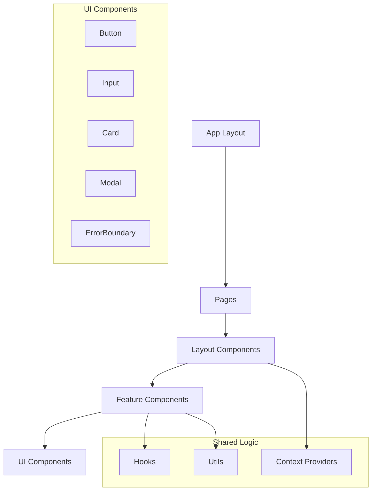

# Persian Medical Bot Architecture

## Application Structure

```mermaid
graph TD
    A[Client Browser] --> B[Next.js Application]
    
    subgraph "Next.js Application"
        B --> C[App Router]
        C --> D[Pages]
        D --> E[Components]
        E --> F[UI Components]
        E --> G[Layout Components]
        E --> H[Form Components]
        E --> I[Feature Components]
        D --> J[API Routes]
        
        K[Hooks] --> E
        L[Utils] --> E
        M[Config] --> E
        N[Types] --> E
        O[Services] --> E
        P[Lib] --> E
    end
    
    J --> Q[External APIs]
    B --> R[Database]
```

## Data Flow

```mermaid
sequenceDiagram
    participant User
    participant UI as UI Components
    participant Hooks as React Hooks
    participant Services as API Services
    participant External as External APIs

    User->>UI: Interaction
    UI->>Hooks: Trigger hook
    Hooks->>Services: API request
    Services->>External: External API call
    External->>Services: Response
    Services->>Hooks: Processed data
    Hooks->>UI: Updated state
    UI->>User: Render updated UI
```

## Component Structure

```mermaid
graph TD
    A[App Layout] --> B[Pages]
    B --> C[Layout Components]
    C --> D[Feature Components]
    D --> E[UI Components]
    
    subgraph "UI Components"
        E1[Button]
        E2[Input]
        E3[Card]
        E4[Modal]
        E5[ErrorBoundary]
    end
    
    subgraph "Shared Logic"
        F[Hooks]
        G[Utils]
        H[Context Providers]
    end
    
    D --> F
    D --> G
    C --> H
``` 